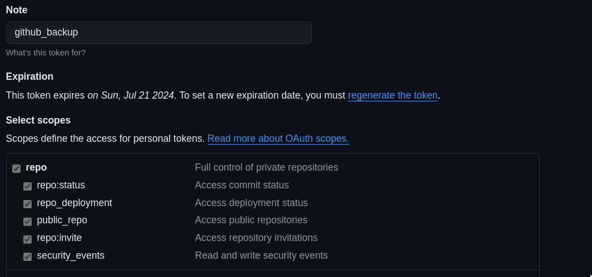

# GitHub Repository Backup

This repository provides scripts to automate the backup of GitHub repositories using Python.

It offers the following functionalities:

- **Cloning:** Clones repositories if they do not exist locally.
- **Updating:** Updates existing repositories if changes are detected on the remote.
- **Submodules:** Handles initialization and updates of submodules within repositories.

## Usage

1. **Obtain a GitHub Personal Access Token**
    
    First, generate a GitHub personal access token with the `repo` scope. This token allows the script to authenticate and access your GitHub repositories. Here’s how you can generate a token:
    
    - Go to [GitHub Settings](https://github.com/settings/tokens).
    - Click on **Generate new token**.
    - Select the `repo` scope and click **Generate token**.
    
    
    
    - Copy the generated token to your clipboard.

2. **Save Your Token**
    
    Save the token securely in a text file on your local machine. For example, you can create a file named `github_token.txt` and paste the token there.
    
    > **Note:** Keep your GitHub personal access token (`github_token.txt`) secure and do not share it publicly.
    
3. **Clone the repo**
    
    ```bash
    git clone git@github.com:IvoBrandao/backup-github-repos.git
    ```

4. **Setup Python (if not already done):**
   - Ensure Python 3.x is installed.

    ```bash
    sudo apt-get install python3
    ```

5. **Clone the Repository:**
   
   ```bash
   git clone git@github.com:IvoBrandao/backup-github-repos.git
   cd backup-github-repos
    ```

6. **Install dependencies:**

     ```bash
     pip3 install -r requirements.txt
     ```

    Alternatively, execute:

     ```bash
     chmod +x setup-env.sh
     ./setup_env.sh
     ```

   This will create the virtual environment and install required packages.

7. **Run:**

   - To execute the script, use:
     
     ```bash
     python backup_repositories.py <token_file> [--output <output_folder>] [--dryrun]
     ```

     - `<token_file>`: Path to a file containing your GitHub personal access token.
     - `--output <output_folder>`: Specify the folder where repositories will be cloned (default: 'repositories').
     - `--dryrun`: Perform a dry run to list repositories without cloning.

    
8. **Monitor Progress**
    
    The script will log its activities to the terminal or command prompt window. It will fetch your GitHub repositories and clone them into the specified output folder. If any errors occur during the process, they will be logged for your review. 


Customize script behavior according to your backup requirements.


## License

This project is licensed under the MIT License. See the [LICENSE](LICENSE) file for more information.

