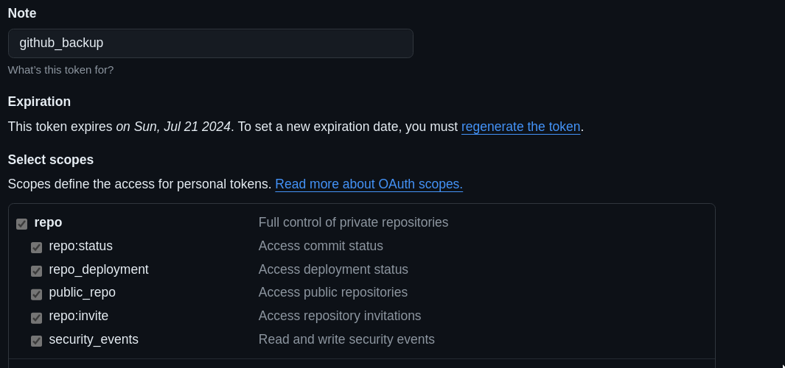

# GitHub Repository Backup

This repository provides scripts to automate the backup of GitHub repositories using Python.

It offers the following functionalities:

- **Cloning:** Clones repositories if they do not exist locally.
- **Updating:** Updates existing repositories if changes are detected on the remote.
- **Submodules:** Handles initialization and updates of submodules within repositories.
- **Filtering:** Exclude forks, archived repositories, or specific repositories.
- **Configuration:** Support for JSON configuration files.
- **Retry Logic:** Automatic retry on failures with configurable delays.
- **Comprehensive Logging:** Detailed logging with multiple log levels and summary statistics.

## Features

- ✅ Clone and update repositories automatically
- ✅ SSH and HTTPS support
- ✅ Submodule support
- ✅ Dry-run mode to preview operations
- ✅ Filter by repository type (forks, archived)
- ✅ Include/exclude specific repositories
- ✅ Retry logic for failed operations
- ✅ Progress tracking with statistics
- ✅ Configuration file support
- ✅ Environment variable support for token
- ✅ Verbose mode for debugging
- ✅ Handles dirty working directories safely
- ✅ GitHub API rate limit awareness

## Installation

### Prerequisites

- Python 3.9 or higher
- Git installed and configured
- GitHub Personal Access Token with `repo` scope

### Setup

1. **Clone the repository:**

    ```bash
    git clone git@github.com:IvoBrandao/backup-github-repos.git
    cd backup-github-repos
    ```

2. **Run the setup script (recommended):**

    The setup script will install [uv](https://github.com/astral-sh/uv) (a fast Python package installer) and create a virtual environment:

    ```bash
    chmod +x setup_env.sh
    ./setup_env.sh
    ```

    This will:
    - Install `uv` if not already installed
    - Create a virtual environment (`.venv`)
    - Install all required packages

3. **Manual installation (alternative):**

    ```bash
    python3 -m venv .venv
    source .venv/bin/activate
    pip install -r requirements.txt
    ```

## Configuration

### GitHub Token

You have two options to provide your GitHub token:

**Option 1: Token File (default)**

1. Generate a GitHub Personal Access Token:
   - Go to [GitHub Settings → Tokens](https://github.com/settings/tokens)
   - Click "Generate new token"
   - Select the `repo` scope
   - Copy the generated token

   

2. Save it to a file:

   ```bash
   echo "your_token_here" > token.txt
   ```

**Option 2: Environment Variable**

```bash
export GITHUB_TOKEN=your_token_here
```

### Configuration File (Optional)

Create a `config.json` file for advanced configuration:

```json
{
  "github": {
    "token_file": "token.txt",
    "use_ssh": true
  },
  "backup": {
    "output_folder": "repositories",
    "verbose": false,
    "max_retries": 3,
    "retry_delay_seconds": 5
  },
  "filters": {
    "exclude_forks": false,
    "exclude_archived": false,
    "include_only": [],
    "exclude": ["repo-to-exclude"]
  }
}
```

See `config.example.json` for a complete example.

## Usage

### Basic Usage

```bash
# Backup all repositories
python github-backup.py token.txt

# Backup to a specific folder
python github-backup.py token.txt -o /path/to/backup

# Dry run (preview without making changes)
python github-backup.py token.txt --dryrun

# Verbose output for debugging
python github-backup.py token.txt -v
```

### Advanced Usage

```bash
# Exclude forks
python github-backup.py token.txt --exclude-forks

# Exclude archived repositories
python github-backup.py token.txt --exclude-archived

# Use configuration file
python github-backup.py --config config.json

# Combine options
python github-backup.py token.txt -o backups --exclude-forks -v
```

### Using Environment Variable for Token

```bash
export GITHUB_TOKEN=your_token_here
python github-backup.py token.txt  # Will use env var if file is empty/missing
```

## Command-Line Options

| Option | Description |
|--------|-------------|
| `token_file` | Path to file containing GitHub token (positional) |
| `-o, --output FOLDER` | Output folder for repositories (default: `repositories`) |
| `-c, --config FILE` | Path to JSON configuration file |
| `--dryrun` | Preview operations without making changes |
| `-v, --verbose` | Enable verbose debug logging |
| `--exclude-forks` | Skip forked repositories |
| `--exclude-archived` | Skip archived repositories |
| `-h, --help` | Show help message |

## How It Works

1. **Authentication:** Authenticates with GitHub using your personal access token
2. **Fetching:** Retrieves list of all repositories accessible to your account
3. **Filtering:** Applies any configured filters (forks, archived, etc.)
4. **Processing:** For each repository:
   - If it doesn't exist locally: **Clone** it
   - If it exists locally: **Update** it (fetch + pull with rebase)
   - Handle submodules automatically
   - Skip repositories with uncommitted changes to avoid conflicts
5. **Summary:** Display statistics of the operation

## Error Handling

The script includes robust error handling:

- **Uncommitted changes:** Skips updates for repositories with local changes
- **Git errors:** Logs detailed error messages
- **API rate limits:** Monitors and warns about GitHub API rate limits
- **Network failures:** Retry logic with configurable delays
- **Interrupted operations:** Clean exit on Ctrl+C

## Output Example

```
2025-12-07 10:30:00 - INFO - Using GitHub token from file: token.txt
2025-12-07 10:30:00 - INFO - Output folder: /path/to/repositories
2025-12-07 10:30:01 - INFO - Authenticating with GitHub...
2025-12-07 10:30:01 - INFO - Authenticated as: username
2025-12-07 10:30:01 - INFO - Fetching repositories...
2025-12-07 10:30:02 - INFO - Successfully fetched 42 repositories
2025-12-07 10:30:02 - INFO - Processing 42 repositories...
------------------------------------------------------------
2025-12-07 10:30:02 - INFO - [1/42] Processing: repo-name
2025-12-07 10:30:02 - INFO - [repo-name] Updating existing repository...
2025-12-07 10:30:03 - INFO - [repo-name] Successfully updated (abc1234)
...
============================================================
BACKUP SUMMARY
============================================================
Total repositories:  42
Cloned:             5
Updated:            35
Failed:             0
Skipped:            2
Duration:           45.23 seconds
============================================================
```

## Logging Levels

- **INFO:** Normal operation messages
- **WARNING:** Non-critical issues (e.g., skipped repositories)
- **ERROR:** Failures that don't stop the entire process
- **DEBUG:** Detailed information (use `-v` flag)

## Best Practices

1. **Regular Backups:** Run the script periodically (e.g., via cron)
2. **SSH Keys:** Configure SSH keys for GitHub to avoid password prompts
3. **Disk Space:** Ensure sufficient disk space before running
4. **Token Security:** Keep your token file secure (never commit to git)
5. **Test First:** Use `--dryrun` to preview changes
6. **Review Logs:** Check logs for any errors or warnings

## Troubleshooting

### "Authentication failed"

- Verify your token has the `repo` scope
- Check token hasn't expired
- Ensure token file is not empty

### "Repository has uncommitted changes"

- Commit or stash changes in the local repository
- Or remove the repository to allow fresh clone

### "Rate limit exceeded"

- Wait for the rate limit to reset (check the log message)
- Consider reducing the frequency of backups

### SSH vs HTTPS

- Default is SSH (requires SSH key setup)
- Use `"use_ssh": false` in config for HTTPS

## License

This project is licensed under the MIT License. See the [LICENSE](LICENSE) file for more information.
